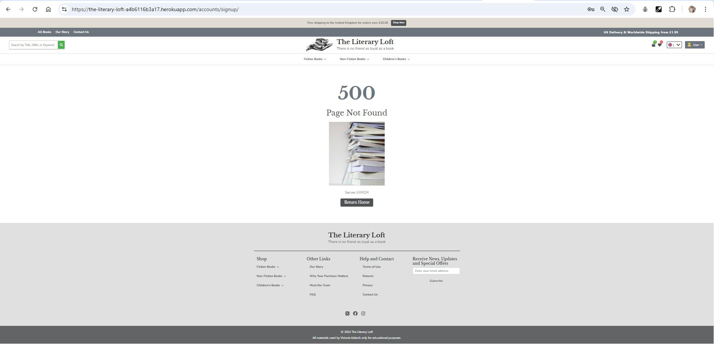
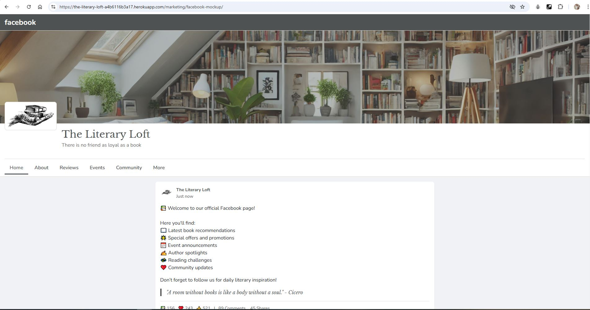
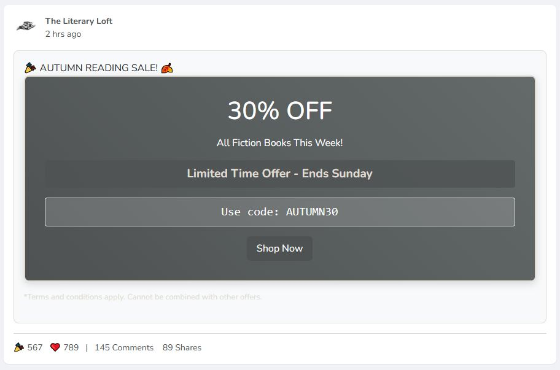
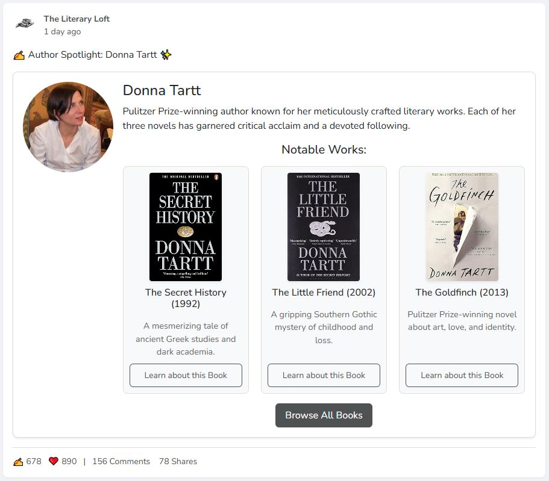
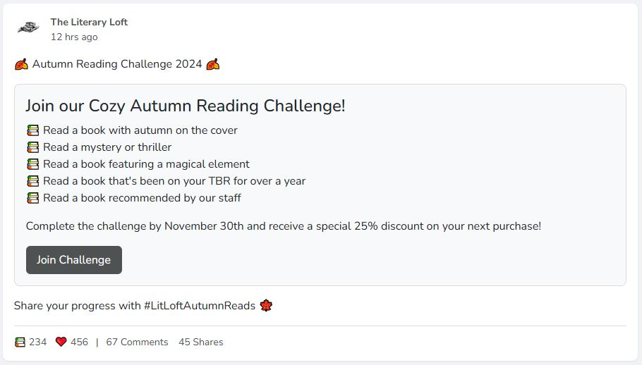
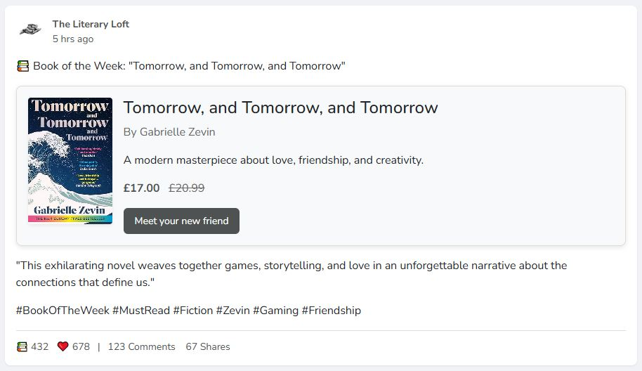
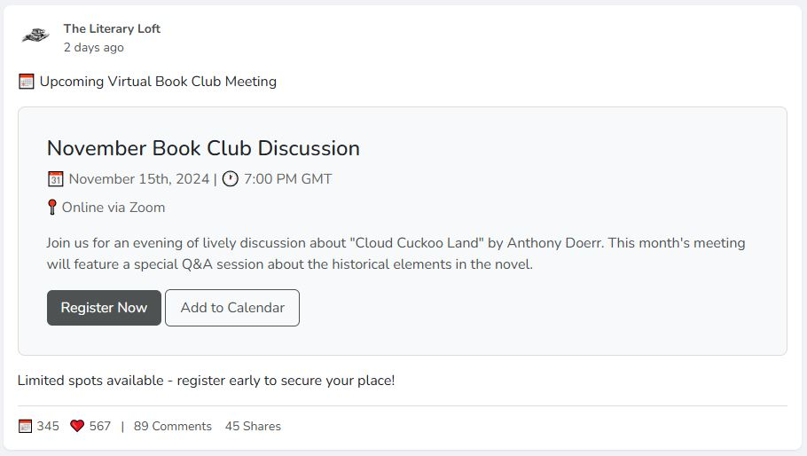
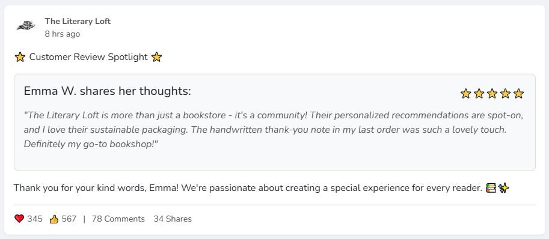
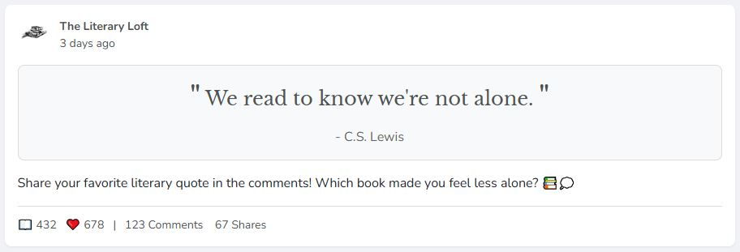

# The Literary Loft

The Literary Loft is an e-commerce platform designed for book lovers to explore and purchase a curated selection of books. This platform aims to provide an intuitive, user-friendly experience that allows users to browse, search, and buy books seamlessly. The Literary Loft is designed to serve both casual readers and avid book collectors by offering a variety of genres and popular titles.
Project is developed using Django framework and Stripe for payment processing, and is deployed on Heroku. The agile method was used to develop the project. [GitHub's Project board](https://github.com/users/vica781/projects/6) was used to implement it.

This project was created as part of my final project with Code Institute and is intended for educational purposes only.

[View the live project here.](https://the-literary-loft-a4b6116b3a17.herokuapp.com/)

## Table of Contents

- [Project Purpose and Objectives](#project-purpose-and-objectives)
- [E-commerce Business Model and Marketing Strategies](#e-commerce-business-model-and-marketing-strategies)
- [User Experience (UX)](#user-experience-ux)
  - [Project Goals](#project-goals)
  - [User Stories](#user-stories)
    - [External User Goals](#external-user-goals)
    - [Admin User Goals](#admin-user-goals)
- [Features](#features)
  - [Existing Features](#existing-features)
    - [User Management](#1-user-management)
    - [Product Browsing and Management](#2-product-browsing-and-management)
    - [Shopping Experience](#3-shopping-experience)
    - [Additional Pages](#4-additional-pages)
    - [Marketing and Engagement](#5-marketing-and-engagement)
    - [Accessibility and Responsive Design](#6-accessibility-and-responsive-design)
    - [Additional Features](#7-additional-features)
- [Design](#design)
  - [Scope](#scope)
  - [Design Choices](#design-choices)
  - [Wireframes](#wireframes)
- [Color Scheme and Typography](#color-scheme-and-typography)
- [Database Design](#database-design)
  - [Entity-Relationship Diagram (ERD)](#entity-relationship-diagram-erd)
  - [Overview of Database Tables](#overview-of-database-tables)
- [Technologies Used](#technologies-used)
- [Marketing and Social Media Presence](#facebook-mockup-page)
  - [Facebook Mockup Page](#facebook-mockup-page)
- [Testing](#testing)  
- [Deployment](#deployment)
- [Credits](#credits)

## Project Purpose and Objectives

The primary goal of The Literary Loft is to simulate a real-world e-commerce application where users can:

- Browse a catalog of books with details and descriptions.
- Search and filter books by title, author, genre, or category.
- Add books to a shopping Bag and complete a secure checkout.
- Purchase books either as a guest or as a registered user. While guest users can make purchases, they are encouraged throughout the process to sign in or register, as only registered users can experience the full benefits of the platform, including:
  - Access to order history for easy reference and reorders.
  - The ability to mark books as favorites for quick access.
  - The option to manage their personal account details and saved preferences.
- Subscribe to a newsletter to stay updated with the latest additions and promotions on The Literary Loft.

The project also aims to give site administrators full control over the inventory, enabling them to add, update, or remove books from the catalog without the need for a separate admin panel.

## Disclaimer

**Note**: This project was developed solely for educational purposes and is not intended for real-world use.
The Literary Loft is a fictional e-commerce platform created as part of the Full Stack Web Development course with Code Institute. The project uses placeholder data for books and images, and no real transactions can be made on the site. The payment processing feature is implemented using Stripe's test mode, and no real payments are processed.

[Back to top ⬆](#table-of-contents)

## E-commerce Business Model and Marketing Strategies

### E-commerce Business Model

*The Literary Loft* operates on a **B2C (Business-to-Consumer)** e-commerce model, where the platform directly sells books to customers. The model aims to provide an engaging and seamless online shopping experience that caters to both casual readers and devoted book lovers. The primary aspects of the business model include:

- **Product Offering**: A curated selection of books spanning different genres such as fiction, non-fiction, and children’s literature. The catalog aims to attract a broad audience with a mix of popular titles, classic works, and niche finds.
- **Revenue Streams**:
  - **Direct Sales**: Income generated through book purchases.
  - **Promotions and Discounts**: Special offers and limited-time sales to increase revenue and customer engagement.
- **Customer Experience**:
  - A user-friendly browsing and purchasing process.
  - Features such as the ability to save books as favorites and view past orders.
  - A seamless checkout process with both guest and registered user options.
- **Order Fulfillment**: A streamlined process for order handling and dispatch, ensuring quick and reliable delivery to customers.

### Marketing Strategies

To achieve the business objectives and increase customer reach, *The Literary Loft* employs a combination of digital marketing strategies designed to attract and retain customers. These include:

#### 1. Social Media Engagement

- **Facebook Mockup Page**: The platform features a dedicated mockup of a Facebook page designed to showcase engaging content, promotions, and author spotlights. This enhances visibility and encourages user interaction. Posts include:
  - Promotions like seasonal sales (e.g., *Autumn Reading Sale* with discount codes).
  - Author spotlights featuring well-known authors and their works.
  - Interactive challenges such as the *Autumn Reading Challenge* to engage users.
  - Community reviews and testimonials to build trust and a sense of community.
- **Social Media Advertising**: Paid advertising campaigns and targeted posts to reach a wider audience and attract new customers.

#### 2. Email Marketing

- **Newsletter Subscription**: Users are encouraged to sign up for newsletters to stay informed about new arrivals, special promotions, and exclusive content. This helps maintain direct communication and build a loyal customer base.
- **Personalized Offers**: Email campaigns tailored to user preferences, with personalized book recommendations and special discounts.

#### 3. SEO (Search Engine Optimization)

- **Content Optimization**: The website is optimized with meta tags, alt text, keywords to improve its search engine ranking and visibility.
- **Blog and Articles**: Future plans include adding blog posts and literary articles that provide value to visitors and help drive organic traffic through long-tail keywords.

#### 4. Seasonal Promotions and Discounts

- **Limited-Time Offers**: Promotions tied to events or seasons (e.g., "30% off all fiction books during Autumn Reading Sale") to incentivize purchases.
- **Coupon Codes**: Providing users with special codes like "AUTUMN30" during sales to encourage immediate action.

#### 5. Community Engagement

- **Virtual Events**: Hosting virtual book club discussions and author Q&A sessions to create a sense of community and attract visitors who value interaction and engagement.
- **User-Generated Content**: Encouraging users to share their favorite book quotes, reviews, and experiences on social media with branded hashtags like #LitLoftAutumnReads.

### Future Marketing Strategies

*The Literary Loft* plans to expand its marketing strategies by incorporating:

- **Influencer Collaborations**: Partnering with book bloggers and influencers to review and promote books to a broader audience.
- **Loyalty Program**: Introducing a points-based system where users earn points for purchases, reviews, and social media shares, redeemable for discounts or exclusive content.

These strategies align with *The Literary Loft's* mission to create an inviting, community-driven space where readers can explore and share their love for books.

[Back to top ⬆](#table-of-contents)

## User Experience (UX)

### Project Goals

The main objective of *The Literary Loft* is to create an engaging and seamless e-commerce experience where users can browse, select, and purchase books from a diverse catalog. The platform is designed to cater to both casual readers and dedicated book enthusiasts by offering an intuitive interface, comprehensive user interaction, and personalized account features.

### Strategy

The strategy for *The Literary Loft* focuses on building a user-centric experience that encourages engagement and repeat visits. Key strategies include:

- Ensuring ease of navigation and the ability to search, filter, and browse through books effortlessly.
- Providing an efficient and secure checkout process for both guest users and registered users.
- Encouraging users to sign up and log in to benefit from enhanced features, such as viewing their full order history and managing their favorite books.
- Integrating a newsletter signup feature to keep users informed about new releases and special promotions.
- Incorporating SEO best practices to improve discoverability and audience reach.

The project aims to create a welcoming and immersive environment for book lovers, offering a curated selection of books and a seamless shopping experience.

[Back to top ⬆](#table-of-contents)

### User Stories

#### EPIC 1: User Management

1. **Register for an Account**
   - *Description*: As a Site User, I want to easily register for an account, so that I can have a personal account and be able to view my profile.
   - *Acceptance Criteria*:
     - User can access a registration page.
     - User can fill out a registration form with necessary details.
     - User receives a confirmation email after successful registration.
   - *Tasks*:
     - Create a registration form.
     - Implement form validation.
     - Set up email confirmation for new registrations.

2. **Login or Logout**
   - *Description*: As a Site User, I want to easily login or logout, so that I can access my personal account information.
   - *Acceptance Criteria*:
     - User can access a login page.
     - User can enter credentials to log in.
     - User can easily log out from their account.
   - *Tasks*:
     - Create a login form.
     - Implement login and logout functionality.
     - Ensure session management for logged-in users.

3. **Password Recovery**
   - *Description*: As a Site User, I want to easily recover my password in case I forget it, so that I can recover access to my account.
   - *Acceptance Criteria*:
     - User can request password recovery.
     - User receives a password recovery email.
     - User can reset their password using the link provided.
   - *Tasks*:
     - Create a password recovery form.
     - Set up email functionality for password recovery.
     - Implement password reset functionality.

4. **Email Confirmation**
   - *Description*: As a Site User, I want to receive an email confirmation after registering, so that I can verify that my account registration was successful.
   - *Acceptance Criteria*:
     - User receives an email upon successful registration.
     - Email contains a link to verify the account.
     - Verification link confirms the user account.
   - *Tasks*:
     - Implement email sending functionality for registration.
     - Create verification link handling.
     - Ensure user account activation upon verification.

5. **Manage User Profile**
   - *Description*: As a Site User, I want to manage my user profile, so that I can update my personal information and preferences.
   - *Acceptance Criteria*:
     - User can view their profile page.
     - User can edit and update personal details.
     - Changes to user profile are saved and reflected in the database.
   - *Tasks*:
     - Create a user profile management interface.
     - Implement profile editing and saving functionality.
     - Ensure database updates upon profile changes.

6. **Manage Account Deletion**
   - *Description*: As a Site User, I want to be able to delete my account, so that I can permanently remove my data from the platform.
   - *Acceptance Criteria*:
     - User can access an option to delete their account.
     - User receives a confirmation prompt before deletion.
     - Account is deleted from the database upon confirmation.
   - *Tasks*:
     - Create a delete account option in the user profile.
     - Implement a confirmation prompt for account deletion.
     - Ensure the account is removed from the database upon confirmation.

[Back to top ⬆](#table-of-contents)

#### EPIC 2: Product Management

1. **Add a Product**
   - *Description*: As a Store Owner, I want to add a product, so that I can add new items to my store.
   - *Acceptance Criteria*:
     - Admin can access a product addition page.
     - Admin can fill out a form with product details such as name, price, description, and image.
     - Admin can submit the form to add the product to the store.
   - *Tasks*:
     - Create a product addition form.
     - Implement form validation.
     - Ensure the product is added to the database and displayed in the store.

2. **Edit/Update a Product**
   - *Description*: As a Store Owner, I want to edit/update a product, so that I can change product prices, descriptions, images, and other product criteria.
   - *Acceptance Criteria*:
     - Admin can access a product editing page.
     - Admin can edit existing product details.
     - Admin can submit the form to update the product information.
   - *Tasks*:
     - Create a product editing form.
     - Implement form validation.
     - Ensure the updated product details are saved in the database.

3. **Delete a Product**
   - *Description*: As a Store Owner, I want to delete a product, so that I can remove items that are no longer for sale.
   - *Acceptance Criteria*:
     - Admin can access a list of products.
     - Admin can select a product to delete.
     - Admin receives a confirmation prompt before deletion.
     - The product is removed from the store upon confirmation.
   - *Tasks*:
     - Create a product deletion interface.
     - Implement a confirmation prompt for deletions.
     - Ensure the product is removed from the database and the store.

4. **View Product Details**
   - *Description*: As a Site User, I want to view detailed information about a product, so that I can make informed purchasing decisions.
   - *Acceptance Criteria*:
     - User can click on a product to view its details.
     - Product details page shows name, price, description, and images.
     - Additional information like stock availability and reviews is displayed.
   - *Tasks*:
     - Create a product details page.
     - Display product information dynamically from the database.
     - Ensure reviews and ratings are visible (if applicable).

5. **Filter and Sort Products by Category and Subcategory**
   - *Description*: As a Site User, I want to filter and sort products by category and subcategory, so that I can find items that match my interests and preferences.
   - *Acceptance Criteria*:
     - User can filter products based on main categories and subcategories.
     - User can sort products by price, rating, or popularity.
     - Filtered and sorted results are displayed dynamically.
   - *Tasks*:
     - Create filtering and sorting logic.
     - Integrate with the product listing page.
     - Implement UI elements for filter and sort options.

[Back to top ⬆](#table-of-contents)

#### EPIC 3: Checkout Process

1. **Add to Bag**
   - *Description*: As a Site User, I want to add products to a shopping bag, so that I can purchase them later.
   - *Acceptance Criteria*:
     - User can add products to their shopping bag.
     - Shopping bag displays added items and total cost.
     - User can continue browsing after adding items to the bag.
   - *Tasks*:
     - Create add to bag functionality.
     - Display bag contents dynamically.
     - Implement a notification system for successful additions.

2. **Review and Edit Bag**
   - *Description*: As a Site User, I want to review and edit my shopping bag, so that I can update quantities or remove items before checkout.
   - *Acceptance Criteria*:
     - User can view their shopping bag.
     - User can update item quantities or remove items.
     - Updated totals are displayed dynamically.
   - *Tasks*:
     - Create a shopping bag review page.
     - Implement editing functionalities for item quantities.
     - Ensure the bag updates in real-time.

3. **Complete Checkout with Payment**
   - *Description*: As a Site User, I want to complete a secure checkout process, so that I can purchase the items in my shopping bag.
   - *Acceptance Criteria*:
     - User can access a checkout page with items, totals, and payment options.
     - User can input payment details and submit for payment.
     - User receives a confirmation of purchase after successful payment.
   - *Tasks*:
     - Create a checkout page.
     - Integrate payment processing (e.g., Stripe).
     - Ensure the user receives feedback on payment status.

4. **Order Confirmation**
   - *Description*: As a Site User, I want to receive an order confirmation, so that I know my purchase was successful.
   - *Acceptance Criteria*:
     - User receives a confirmation message on the site after checkout.
     - Confirmation email is sent with order details.
   - *Tasks*:
     - Implement on-site confirmation message.
     - Set up confirmation email template.
     - Ensure order details are displayed correctly.

5. **Guest Checkout Option**
   - *Description*: As a Site Visitor, I want to make a purchase without registering, so that I can complete an order quickly.
   - *Acceptance Criteria*:
     - Guest users can proceed to checkout without an account.
     - Guest users are encouraged to register or sign in for benefits (e.g., order history).
     - Guest user data is handled securely for checkout.
   - *Tasks*:
     - Enable guest checkout feature.
     - Implement prompts for user registration benefits.
     - Secure guest data during the process.

[Back to top ⬆](#table-of-contents)

#### EPIC 4: SEO and Marketing

1. **Implement Meta Tags**
   - *Description*: As a Site Owner, I want to include meta tags on my website, so that it improves SEO and helps with search engine visibility.
   - *Acceptance Criteria*:
     - All pages have meta tags that reflect page content.
     - Meta tags include descriptions, keywords, and author information.
   - *Tasks*:
     - Add meta tags to all main pages.
     - Ensure descriptions and keywords are relevant.
     - Test SEO improvements using validation tools.

2. **Create and Add Sitemap.xml**
   - *Description*: As a Site Owner, I want to create and add a sitemap.xml file, so that search engines can easily crawl my site.
   - *Acceptance Criteria*:
     - A valid sitemap.xml file is present.
     - Sitemap includes links to all pages.
   - *Tasks*:
     - Generate sitemap.xml.
     - Add sitemap.xml to the root directory.
     - Test sitemap with search engine tools.

3. **Add robots.txt**
   - *Description*: As a Site Owner, I want to add a robots.txt file, so that I can control which pages are crawled by search engines.
   - *Acceptance Criteria*:
     - A valid robots.txt file is present.
     - Instructions in robots.txt prevent unwanted pages from being indexed.
   - *Tasks*:
     - Create robots.txt file.
     - Add specific instructions for search engines.
     - Test the file using online tools.

4. **Newsletter Signup Functionality**
   - *Description*: As a Site Owner, I want to add a newsletter signup form, so that I can collect emails for marketing purposes.
   - *Acceptance Criteria*:
     - Users can enter their email to subscribe to the newsletter.
     - Form validates emails and provides success feedback.
     - Data is stored securely for future use.
   - *Tasks*:
     - Create newsletter signup form.
     - Implement email validation.
     - Store email data securely.

5. **Create Facebook Business Page**
   - *Description*: As a Site Owner, I want to create a Facebook Business Page, so that I can increase brand reach and engage with users on social media.
   - *Acceptance Criteria*:
     - Facebook Business Page is set up with appropriate branding.
     - Page includes links to the site and basic business information.
   - *Tasks*:
     - Create Facebook Business Page.
     - Add branding elements (logo, cover photo).
     - Include links and business details.

[Back to top ⬆](#table-of-contents)

#### EPIC 5: Site Management & Security

1. **Secure Payment Integration (e.g., Stripe)**
   - *Description*: As a Site Owner, I want to securely integrate payment processing, so that users can make payments safely.
   - *Acceptance Criteria*:
     - Payment processing is securely integrated using Stripe or another service.
     - User data is protected during the transaction.
     - Site shows clear feedback for payment success/failure.
   - *Tasks*:
     - Integrate payment service (e.g., Stripe).
     - Ensure secure data handling.
     - Test payment process for security and functionality.

2. **Role-Based Access Control**
   - *Description*: As a Site Owner, I want to implement role-based access control, so that only authorized users can access certain parts of the site.
   - *Acceptance Criteria*:
     - Admins have access to management pages.
     - Regular users can only access public content.
     - Unauthorized access attempts are blocked.
   - *Tasks*:
     - Implement role-based access control.
     - Secure admin routes.
     - Test user roles for proper access.

3. **Set Up Environment Variables for Security**
   - *Description*: As a Developer, I want to use environment variables, so that sensitive data is not exposed in the code.
   - *Acceptance Criteria*:
     - Environment variables are used for API keys, secret keys, etc.
     - Variables are properly hidden in the .env file and not pushed to the repository.
   - *Tasks*:
     - Set up environment variables in the project.
     - Hide .env file using .gitignore.
     - Ensure sensitive data is not exposed.

4. **Debug Mode Off for Deployment**
   - *Description*: As a Developer, I want to turn off debug mode for deployment, so that the site is secure and users don’t see detailed error information.
   - *Acceptance Criteria*:
     - DEBUG mode is turned off in the deployment settings.
     - Site handles errors gracefully without revealing details.
   - *Tasks*:
     - Ensure debug mode is turned off in the production environment.
     - Test error handling.
     - Confirm site functionality without debug mode.

[Back to top ⬆](#table-of-contents)

#### EPIC 6: Testing & Deployment

1. **Unit Testing for User Forms**
   - *Description*: As a Developer, I want to perform unit testing for user forms, so that I can ensure the form functionality works as intended.
   - *Acceptance Criteria*:
     - User forms are tested for input validation.
     - Form submission behavior is verified.
   - *Tasks*:
     - Write test cases for user forms.
     - Ensure test coverage includes form validation.
     - Verify form submissions with test data.

2. **Integration Testing for Checkout**
   - *Description*: As a Developer, I want to perform integration testing for the checkout process, so that I can ensure all components work together seamlessly.
   - *Acceptance Criteria*:
     - Test covers adding items to the Bag, reviewing the Bag, and completing payment.
     - Edge cases such as empty carts or invalid payment data are tested.
   - *Tasks*:
     - Write integration tests for the checkout process.
     - Test with different scenarios (e.g., guest user, registered user).
     - Validate successful payment and order confirmation.

3. **Validation Testing (HTML, CSS, JS, Python)**
   - *Description*: As a Developer, I want to validate my code, so that I can ensure it meets standards and has no critical issues.
   - *Acceptance Criteria*:
     - Code passes validation checks for HTML, CSS, JS, and Python.
     - Code adheres to PEP8 for Python and linting rules for JavaScript.
   - *Tasks*:
     - Run code through validation tools.
     - Fix any issues identified in the validation report.
     - Re-run validation to confirm issues are resolved.

4. **User Acceptance Testing**
   - *Description*: As a Site Owner, I want to perform user acceptance testing, so that I can ensure the project meets user needs and requirements.
   - *Acceptance Criteria*:
     - Users provide feedback after testing.
     - Any critical issues found during testing are addressed.
   - *Tasks*:
     - Create user testing plan.
     - Collect feedback from test users.
     - Address any major issues discovered.

5. **Bug Fixes and Iterations**
   - *Description*: As a Developer, I want to address bugs and iterate on feedback, so that I can improve the application before final deployment.
   - *Acceptance Criteria*:
     - All major bugs are fixed.
     - Iterations are made based on feedback.
   - *Tasks*:
     - Track bugs found during testing.
     - Implement fixes and test the resolution.
     - Make iterations based on user feedback.

[Back to top ⬆](#table-of-contents)

#### External User Goals

- **As a visitor**, I want to easily browse books by genre, title, or author, so that I can find books that interest me without any hassle.
- **As a shopper**, I want to add books to a shopping Bag and see the total price, so that I can manage my budget before making a purchase.
- **As a registered user**, I want to save my favorite books for future reference and view my past orders, so that I can easily access books I am interested in and keep track of my purchases.
- **As a visitor**, I want the option to make a purchase as a guest, so that I can buy books without needing to create an account.
- **As a visitor**, I want to sign up for a newsletter, so that I can stay informed about new arrivals and promotions.
- **As a registered user**, I want to be able to manage my account details, so that I can update my information as needed.
- **As a shopper**, I want to receive an order confirmation email, so that I have a record of my purchase.

[Back to top ⬆](#table-of-contents)

#### Admin User Goals

- **As an admin**, I want to add, update, or delete books directly from the platform, so that I can manage the store’s inventory efficiently.
- **As an admin**, I want to access an overview of the store’s products, so that I can see which books are in stock or need restocking.
- **As an admin**, I want to be notified when purchases are made, so that I can manage order fulfillment promptly.
- **As an admin**, I want to manage user accounts, so that I can handle issues or requests efficiently.
- **As an admin**, I want to monitor and manage newsletter subscriptions, so that I can engage with users effectively.
- **As an admin**, I want the platform to be secure with role-based access control, so that only authorized users can access sensitive data or make changes.

[Back to top ⬆](#table-of-contents)

## Features

### Existing Features

### 1. User Management

- **User Registration and Login**: Users can create an account and log in to access their personalized experience, including viewing and managing their profiles.
- **Password Recovery**: Users can recover their password if forgotten via an email recovery process.
- **Profile Management**: Registered users can update their personal information and manage their order history.
- **Newsletter Signup**: Users can sign up for newsletters to stay informed about new arrivals and promotions. (Note: Currently, there is no unsubscribe option available.)
- **Order History Management**: Users can sort their order history in ascending or descending order by date or price for better navigation and management.

[Back to top ⬆](#table-of-contents)

### 2. Product Browsing and Management

- **Browse and Search**: Users can browse books by genre, title, or author using an intuitive search bar and category filters.
- **Book Details Page**: Each book has a dedicated page showcasing its details, including title, author, description, and price.
- **Favorites Feature**: Registered users can mark books as favorites for quick access later.
- **Admin Management**: Admins can add, edit, or delete books, ensuring efficient catalog management. Admins can enter the number of each book in stock, although tracking stock changes after purchases is not currently available.

[Back to top ⬆](#table-of-contents)

### 3. Shopping Experience

- **Add to Bag**: Users can add books to a shopping bag for review before purchase. The "Bag" icon in the navbar displays the count of books added but does not currently show the total cost.
- **Bag Review and Edit**: The shopping bag page allows users to view selected items, adjust quantities, or remove items before proceeding to checkout.
- **Checkout Process**: A secure checkout process is in place using Stripe for payment, ensuring user transactions are handled safely.
- **Guest Checkout**: Visitors can complete their purchases without registering for an account, making the shopping process flexible and user-friendly.
- **Continue Shopping Button**: A convenient "Continue Shopping" button allows users to return to browsing without disrupting their purchase process.

[Back to top ⬆](#table-of-contents)

#### 4. Additional Pages

- **Homepage**: A welcoming landing page featuring highlighted books, an inviting design, and a search bar to encourage exploration. Multiple currency options (£, $, €) are displayed, though the ability to select a preferred currency during the purchasing process has not been implemented.
- **Our Story**: A page detailing the journey, mission, and values of *The Literary Loft*, complete with informative sections and team introductions.
- **Contact Us**: Provides users with contact information, including location details, a map, and a message form for queries.
- **FAQ Section**: Answers common questions about the store and shopping process.

[Back to top ⬆](#table-of-contents)

### 5. Marketing and Engagement

- **Newsletter Signup**: A feature for users to subscribe to a newsletter and stay updated on new arrivals and promotions.
- **SEO Optimization**: Implementation of meta tags, a sitemap, and a `robots.txt` file to boost search engine discoverability.

### 6. Accessibility and Responsive Design

- **Responsive Layout**: The entire site is designed to be fully responsive, ensuring usability across all devices, from mobile to desktop.
- **Accessible Design**: Adheres to accessibility standards for a seamless experience for all users, including screen reader compatibility.

### 7. Additional Features

### Custom 404 and 500 Error Pages

To enhance the user experience, even in cases where errors occur, *The Literary Loft* includes custom error pages for:

- **404 Error Page**: This page is displayed when a user tries to access a page that does not exist. The 404 page maintains the overall design aesthetics of the site, ensuring users are not abruptly faced with a default browser error message. It provides a user-friendly message and suggestions to navigate back to the main pages.

- **500 Error Page**: The 500 error page is shown when there is an internal server error. This custom page helps reassure users that an issue has been detected and is being addressed.

These custom error pages contribute to a consistent and professional user experience, minimizing frustration and guiding users when issues occur.

[Back to top ⬆](#table-of-contents)

### Features to Implement in the Future

### 1. Enhanced Review System

- **User Reviews**: Allow users to leave reviews and rate books, adding community feedback to the platform.

### 2. Unsubscribe Option for Newsletters

- **Unsubscribe Feature**: Provide users with the ability to unsubscribe from the newsletter at their convenience.

### 3. Account Deletion

- **User Profile Deletion**: Implement a feature allowing users to permanently delete their account and data from the platform.

#### 4. Enhanced Cart Functionality

- **Total Cost Display**: Update the "Bag" icon to reflect both the number of items and the total cost of the contents for better user experience.

[Back to top ⬆](#table-of-contents)

### 5. Stock Management

- **Inventory Tracking**: Enable automatic tracking of book stock levels, adjusting the available quantity when purchases are made.

#### 6. Personalized Recommendations

- **AI-Powered Suggestions**: Implement a recommendation system that suggests books based on users’ browsing and purchase history.

### 7. Advanced Filtering Options

- **Refined Search Capabilities**: Add additional filtering options such as price range, publication year, and author nationality.

#### 8. Admin Dashboard Enhancements

- **Sales Analytics**: Provide detailed analytics for admins to track sales trends and user engagement.

- **Bulk Uploads**: Enable admins to upload multiple books at once using CSV files for faster catalog management.

These features aim to further enrich the user experience and provide more management tools for the admin side.

[Back to top ⬆](#table-of-contents)

## DESIGN

### Scope

To meet the goals outlined above, the project will include the following features:

- **User Registration and Account Management**: Users can create an account, log in, log out, and manage their personal details and order history.
- **Product Browsing and Search Functionality**: Users can browse the book catalog and search for specific books by genre, title, author, or keywords.
- **Shopping Bag**: Users can add books to a shopping Bag, review their selections, update quantities, and remove items.
- **Checkout Process**: A secure, streamlined checkout process using Stripe integration for payment.
- **Guest Checkout**: Users can complete a purchase without creating an account.
- **Order Confirmation**: Users receive on-site and email confirmation after successful checkout.
- **Admin Dashboard**: Admins can add, update, or delete books, manage inventory, and access user data as needed.
- **Newsletter Signup**: Users can subscribe to a newsletter for updates on new books and promotions.
- **SEO Optimization**: The site will include meta tags, a sitemap, and a robots.txt file to enhance discoverability.
- **Accessibility Features**: The design and layout will ensure accessibility for all users, following best practices.

[Back to top ⬆](#table-of-contents)

### Design Choices

The design of *The Literary Loft* focuses on accessibility, ease of use, and aesthetics that appeal to book lovers. Key design elements include:

- **Color Scheme**: The platform features a warm and cozy color scheme that reflects the ambiance of a home library. Shades of soft beige, light brown, and accents of green and dark gray create an inviting atmosphere for readers. The color palette is chosen to evoke warmth, comfort, and relaxation, enhancing the user's browsing experience.

- **Typography**: The website uses a combination of elegant and readable fonts:
  - **Headers and Key Elements**: The serif font *Libre Baskerville* is used to give a classic, sophisticated feel, emphasizing the traditional and literary atmosphere.
  - **Body Text**: The sans-serif font *Nunito* is utilized for body text to ensure clarity and readability, enhancing the modern, user-friendly aspect of the site.
  - These fonts were chosen for their aesthetic balance between classic literature and contemporary readability, creating a pleasant and harmonious reading experience.

- **Layout**: A clean, grid-based layout is implemented for intuitive navigation and content exploration. The header features a fixed navigation bar with direct links to essential pages, while the footer includes quick access to social media, a newsletter subscription form, and additional informational links.

- **Imagery**: High-resolution images of bookshelves, book covers, and reading spaces are used to reinforce the cozy, bookish theme of the platform. The homepage features an inviting image of a well-lit reading nook with bookshelves full of books, adding to the ambiance and making users feel at home.

- **Responsive Design**: The website is fully responsive, ensuring optimal performance on all devices, from mobile phones to desktop computers. Media queries and flexible grid layouts help maintain a consistent user experience across different screen sizes.

- **Interactive Elements**: Subtle hover effects on buttons and links are implemented for visual feedback and to guide user interaction. Clear call-to-action (CTA) buttons encourage engagement, while interactive elements provide feedback when users add items to their Bag or interact with other features on the site.

These design choices were made to create a welcoming and enjoyable browsing experience, encouraging users to explore the catalog and engage with *The Literary Loft*.

[Back to top ⬆](#table-of-contents)

### Wireframes

Wireframes were created at the start of the project to visualize the structure and layout of the key pages and elements. These wireframes guided the development process to ensure that the final design aligned with the project's goals, providing a clear user experience and functionality.

The complete set of wireframes can be found in the following file: [Wireframes File - The Literary Loft](readme_files/wireframes/the_literary_loft.pdf)

Wireframes include:

- **Landing Page**: The landing page is designed to create an inviting atmosphere that aligns with the store’s theme of a cozy literary space. The page prominently features:
  - **Header**: A clear and structured navigation bar that allows users to explore different book categories (Fiction, Non-Fiction, Children's Books) and access key pages such as 'All Books,' 'Our Story,' and 'Contact Us.' The header also includes a search bar, providing users with an easy way to find specific books by title, ISBN, or keyword.
  - **Promotional Banner**: A visually appealing, thin banner at the top of the page highlights important information, such as free shipping offers and other promotions.
  - **Main Hero Section**: A large, high-quality image depicting a well-organized, inviting reading space filled with books. This section sets the tone for the website, evoking the feeling of stepping into a personal library. Overlay text on the image reads, "Step into The Literary Loft and find your companion," creating an engaging introduction.
  - **Main Call-to-Action**: A prominent 'Shop Now' button below the hero image encourages users to start exploring the store.
  - **Introductory Information**: Below the hero section, there is a welcoming message that sets the ambiance and presents the core message of the store: "Your sanctuary for loyal literary friends."
  - **Footer**: The page ends with a well-structured footer that includes:
    - **Quick Access Links**: Links to important sections such as 'Our Story,' 'Why Your Purchase Matters,' 'Meet the Team,' and FAQs.
    - **Shop Categories**: Easy navigation to Fiction, Non-Fiction, and Children's book sections.
    - **Contact Information and Social Media**: Links to social media platforms and options to contact the store.
    - **Newsletter Subscription**: A field where users can enter their email to subscribe to updates and special offers.
    - **Legal Information**: A statement clarifying that the content is used solely for educational purposes.

This comprehensive layout ensures users feel welcomed, engaged, and are encouraged to explore further into the website. The design and structure focus on ease of navigation, promoting a seamless experience from the first interaction.

- **Common Elements**: Consistent header (navigation bar) and footer sections designed to appear on all pages, ensuring seamless navigation and quick access to important site areas.
- **Combined Books Page**:
  - **All Books Page (Customer View)**: A grid layout displaying all available books with options to filter and sort.
  - **Admin View**: The same page with added functionalities for CRUD (Create, Read, Update, Delete) operations.
  - **Individual Book Page**: Detailed view of each book, showing book title, author, price, description, and customer reviews.
- **'Our Story' Page**:
  - Sections that detail the journey of the business, including:
    - *Our Beginnings*: How the store was founded.
    - *Building the Dream*: The development and growth journey.
    - *Growing Together*: Collaborations and community involvement.
    - *Our Mission & Values*: The core principles guiding the business.
  - Subsections such as:
    - *Why Your Purchase Matters*: Information on the impact of purchases.
    - *Meet the Team*: Profiles of key team members.
    - *Join Our Journey*: Call-to-action for user involvement.
    - *FAQs*: A section with frequently asked questions.
- **Contact Us Page**:
  - Contains detailed shop information, including:
    - Address and contact numbers.
    - A map for location guidance.
    - Instructions for reaching the shop using different transport modes.
    - A *Send Us a Message* form for user inquiries.
- **Shopping Bag Page**: An overview of selected books, allowing users to review items, update quantities, or remove items before proceeding to checkout.
- **Favourite Books Page**: A personalized page where registered users can save and view their favorite books for easy access.
- **User Pages** (Combined Wireframe):
  - *Create Account Page*: Form for new users to register.
  - *Login Page*: User authentication interface.
  - *My Account Page*: Allows users to view and manage their profile information and past orders.
- **Order-Related Pages** (Combined Wireframe):
  - *Checkout Page*: Form-based page for delivery and payment details.
  - *Order Summary Page*: Provides a final overview of the user's order before submission.
  - *Orders History Page*: Displays past orders for registered users.

These wireframes were essential in mapping out the user journey, ensuring intuitive navigation, and planning interactions across different user roles (e.g., customers, administrators).

[Back to top ⬆](#table-of-contents)

## Color Scheme and Typography

### Color Scheme

The color scheme for *The Literary Loft* was chosen with the intention of evoking feelings of happiness, coziness, warmth, and homeliness. This reflects the developer’s deep love for reading and the desire to pass that passion on to users. The choice of soft and warm shades of grey for the navigation bar, footer, buttons, and other elements was made to complement the atmosphere created by the landing image and the favicon.

The following elements illustrate the carefully chosen visual aesthetic:

- **Landing Page Image**: The main landing image sets the tone for the entire site, depicting a welcoming and cozy reading loft.

[Back to top ⬆](#table-of-contents)

- **Favicon**: The favicon is a black-and-white pencil sketch of a hand gently holding a stack of books, symbolizing the warmth and personal touch associated with reading.

The combination of these elements creates a seamless and visually appealing user experience that emphasizes the comfort and joy of reading.

[Back to top ⬆](#table-of-contents)

### Typography

The fonts used throughout the site were selected to reinforce the theme of classic literature combined with a modern reading experience. The font choices reflect the app's balance between traditional and contemporary elements:

#### Main Title and Branding

- **Font Used**: *Libre Baskerville* (Bold)
- **Application**: Main title, "THE LITERARY LOFT," in the app's logo.
- **Characteristics**: *Libre Baskerville* provides an elegant, classic feel that connects to the heritage of printed books. Its serif details and high contrast enhance readability and give the app an authoritative, literary ambiance.

#### Subtitles and Body Text

- **Font Used**: *Nunito* (Regular)
- **Application**: Subtitles, including "There is no friend as loyal as a book," and the body text throughout the site.
- **Characteristics**: *Nunito* is a sans-serif font with a friendly and modern appearance. Its clean and balanced design ensures high readability, even at smaller sizes. The rounded shapes of *Nunito* add warmth and approachability, aligning well with the overall theme of coziness and comfort.

### Font Pairing Analysis

The combination of *Libre Baskerville* and *Nunito* was not coincidental. These fonts work together to create a harmonious balance of elegance and modernity:

- **Contrast and Hierarchy**: *Libre Baskerville* establishes prominence for the main title, while *Nunito* complements it with clarity for body text and secondary elements.
- **Visual Balance**: The serif nature of *Libre Baskerville* contrasts with the modern, rounded sans-serif of *Nunito*, adding visual interest without overwhelming the reader.
- **Theme Reinforcement**: The font pairing supports the literary theme and echoes the feelings of nostalgia associated with physical books.

In summary, the color scheme, typography, and imagery were chosen with the goal of creating an inviting and literary-themed platform that resonates with book lovers, encouraging them to stay and explore.

[Back to top ⬆](#table-of-contents)

### Database Design

The database design for *The Literary Loft* was carefully structured to ensure data integrity and efficient relationships between different entities. The project uses a relational database schema that captures key elements necessary for a functional e-commerce platform.

#### Entity-Relationship Diagram (ERD)

Below is the Entity-Relationship Diagram (ERD) that illustrates the structure of the database for *The Literary Loft*. This ERD highlights the relationships between users, orders, books, categories, and other key data tables in the application.

#### Overview of Database Tables

1. **User**: Stores information about registered users, including their credentials and profile details.
   - `id`: Primary key, unique identifier for the user.
   - `username`, `password`, `email`: Essential fields for authentication and communication.
   - `firstName`, `lastName`: Optional profile fields.
   - Timestamps for creation and updates (`createdAt`, `updatedAt`).

2. **Order**: Captures the details of orders placed by users.
   - Linked to the `User` table through a foreign key.
   - Contains order details such as `order_number`, `full_name`, `email`, and `delivery details`.
   - `order_total`, `delivery_cost`, and `grand_total` fields for financial tracking.

3. **OrderItem**: Represents individual items within an order.
   - Connected to both `Order` and `Book` through foreign keys.
   - Tracks `quantity`, `price`, and `item_total`.

4. **Book**: Stores details about each book available on the platform.
   - `id`: Primary key, unique identifier for each book.
   - `title`, `author`, `isbn`, `price`, `stock`, `cover_image`, and detailed descriptions.
   - Linked to `Subcategory` through a foreign key.

5. **Category** and **Subcategory**: Used to classify books into main genres and sub-genres.
   - `Category` table includes main classifications (e.g., Fiction, Non-Fiction, Children's Books).
   - Each `Subcategory` links back to a `Category`, maintaining the hierarchical structure.

6. **Newsletter**: Keeps records of users who have subscribed to receive updates and promotions.
   - Includes fields like `email`, `date_subscribed`, `is_active`, and `status`.

This comprehensive database design ensures that user interactions, book management, and order processing are well-integrated and operate smoothly within the application.

[Back to top ⬆](#table-of-contents)

## Technologies Used

- **Languages**: HTML5, CSS3, JavaScript, Python
- **Frameworks and Libraries**: Django, Bootstrap 4.6, CKEditor 5
- **Database**: PostgreSQL hosted on Neon.tech
- **Version Control**: Git and GitHub for code management
- **Deployment and Hosting**: Heroku for deploying and hosting the web application
- **Payment Integration**: Stripe for processing secure payments

[Back to top ⬆](#table-of-contents)

## Facebook Mockup Page

To meet the requirement for digital marketing evidence, a [Facebook Mockup Page](https://the-literary-loft-a4b6116b3a17.herokuapp.com/marketing/facebook-mockup/) for *The Literary Loft* was created. This mockup simulates the social media presence of the bookstore and demonstrates how various types of content would be shared to engage users and promote the platform's offerings.

The mockup includes:

### 1. **Landing Page Overview**

The main landing page of *The Literary Loft* on Facebook features an inviting cover image that reflects the cozy and welcoming atmosphere of the store, accompanied by the store's logo and slogan: "There is no friend as loyal as a book."

### 2. **Welcome Post**

An introductory post that welcomes users to the official Facebook page, highlighting what they can find on the page such as book recommendations, event announcements, author spotlights, and more.

### 3. **Author Spotlight Post**

A dedicated post featuring an author spotlight with a short biography and notable works. This helps engage users who are interested in discovering new authors or learning more about their favorite writers.

### 4. **Promotional Offer**

A promotional post announcing a limited-time discount for fiction books. This encourages engagement and drives traffic to the website, creating urgency for users to take advantage of the deal.

### 5. **Book of the Week**

A featured post showcasing the "Book of the Week," complete with a brief description and a call-to-action button. This type of post draws attention to specific titles and encourages readers to explore new recommendations.

### 6. **Upcoming Book Club Meeting**

A post that announces an upcoming book club meeting, including details about the book to be discussed and how users can register to join. This helps foster a sense of community among readers.

### 7. **Customer Review Spotlight**

Highlighting customer feedback to build trust and credibility. Positive reviews are showcased to create an engaging and authentic connection with potential readers.

### 8. **Literary Quote Post**

A post featuring an inspiring literary quote to resonate with the audience and encourage interaction through likes, comments, and shares.

These posts reflect a well-rounded content strategy aimed at promoting user interaction, sharing valuable information, and enhancing the brand presence of *The Literary Loft*.

[Back to top ⬆](#table-of-contents)

## Testing

The testing details are provided in a separate file [TESTING.md](TESTING.md).

[Back to top ⬆](#table-of-contents)

## Bugs and known issues

After careful and detailed testing and implemented bugfixes, there are no bugs in the code. However, the following known issues were identified during testing:

- Because of using the Gmail API as a backend for sending emails, hotmail users may experience issues with receiving emails.

## Deployment

The project was deployed on Heroku, a cloud platform that provides a secure and scalable environment for hosting web applications. The deployment process involved setting up the necessary environment variables, configuring the database, and deploying the application to Heroku.

Deployed link: [https://the-literary-loft-a4b6116b3a17.herokuapp.com/](https://the-literary-loft-a4b6116b3a17.herokuapp.com/)

[Back to top ⬆](#table-of-contents)

## Credits

Images used in the project were mostly sourced from [Unsplash](https://unsplash.com/) and [Pexels](https://www.pexels.com/). The images for the books coveres were sourced from the different e-commerce platforms such as [Amazon](https://www.amazon.com/), [Barnes & Noble](https://www.barnesandnoble.com/), and [Book Depository](https://www.bookdepository.co.uk/).

I wish to thank all who have helped me with this project, especially my mentor Brian Macharia, my dearest friend Tomislav Dukez, and my dear colleagues at Code Institute. A special thanks to my precious sons Ilya and Tim, who have been my constant support and encouragement throughout the project.

[Back to top ⬆](#table-of-contents)

## Copyright

&copy; 2025 Victoria Kalenik
