# Testing

To return to main documentation of 'The Literary Loft' project click here [README.md](README.md).

This contains the testing details for the project 'The Literary Loft'.

## Table of Contents

- [User Stories Testing](#user-stories-testing)
  - [EPIC 1: User Management](#epic-1-user-management)
    - [1. Register for an Account](#1-register-for-an-account)
    - [2. Login or Logout](#2-login-or-logout)
    - [3. Password Recovery](#3-password-recovery)
    - [4. Email Confirmation](#4-email-confirmation)
    - [5. Manage User Profile](#5-manage-user-profile)
    - [6. Manage Account Deletion](#6-manage-account-deletion)
  - [EPIC 2: Product Management](#epic-2-product-management)
    - [1. Add a Product](#1-add-a-product)
    - [2. Edit/Update a Product](#2-editupdate-a-product)
    - [3. Delete a Product](#3-delete-a-product)
    - [4. View Product Details](#4-view-product-details)
    - [5. Filter and Sort Products](#5-filter-and-sort-products)
  - [EPIC 3: Checkout Process](#epic-3-checkout-process)
    - [1. Add to Bag](#1-add-to-bag)
    - [2. Review and Edit Bag](#2-review-and-edit-bag)
    - [3. Complete Checkout with Payment](#3-complete-checkout-with-payment)
    - [4. Order Confirmation](#4-order-confirmation)
    - [5. Guest Checkout Option](#5-guest-checkout-option)
  - [EPIC 4: SEO and Marketing](#epic-4-seo-and-marketing)
    - [1. Implement Meta Tags](#1-implement-meta-tags)
    - [2. Create and Add Sitemap.xml](#2-create-and-add-sitemapxml)
    - [3. Add robots.txt](#3-add-robotstxt)
    - [4. Newsletter Signup Functionality](#4-newsletter-signup-functionality)
    - [5. Create Facebook Business Page](#5-create-facebook-business-page)
  - [EPIC 5: Site Management & Security](#epic-5-site-management--security)
    - [1. Secure Payment Integration](#1-secure-payment-integration)
    - [2. Role-Based Access Control](#2-role-based-access-control)
    - [3. Set Up Environment Variables](#3-set-up-environment-variables)
    - [4. Debug Mode Off for Deployment](#4-debug-mode-off-for-deployment)
- [External User Goals](#external-user-goals)
- [Admin User Goals](#admin-user-goals)
- [Summary](#summary)
- [Manual Testing](#manual-testing)
  - [Testing Overview](#testing-overview)
  - [Testing Environment](#testing-environment)
  - [Evidence Collection Methodology](#evidence-collection-methodology)
  - [Functional Testing](#functional-testing)
    - [Navigation & Header Testing](#navigation--header-testing)
    - [User Authentication Testing](#user-authentication-testing)
    - [Product Browsing Testing](#product-browsing-testing)
    - [Product Details Testing](#product-details-testing)
    - [Shopping Bag Testing](#shopping-bag-testing)
    - [Checkout Testing](#checkout-testing)
    - [User Profile Testing](#user-profile-testing)
    - [Admin Functionality Testing](#admin-functionality-testing)
  - [Compatibility Testing](#compatibility-testing)
    - [Browser Compatibility Testing](#browser-compatibility-testing)
    - [Responsive Design Testing](#responsive-design-testing)
  - [Performance Observations](#performance-observations)
  - [Summary of Manual Testing](#summary-of-manual-testing)
- [Validator Testing](#validator-testing)

### Overview

This document details the testing procedures and results for each user story implemented in 'The Literary Loft' project. Each user story has been systematically tested to ensure all acceptance criteria are met and the functionality works as intended.

## User Stories Testing

## EPIC 1: User Management

### 1. Register for an Account

| **Test Case** | **Steps** | **Expected Result** | **Actual Result** | **Status** |
|---------------|-----------|---------------------|-------------------|------------|
| Access registration page | Navigate to homepage and click "Register" | Registration page loads with form | Registration page loaded successfully | ✅ PASS |
| Complete registration form | Fill in username, email, password and click "Sign Up" | Form submits successfully | Form submitted successfully | ✅ PASS |
| Form validation | Submit form with invalid data (e.g., mismatched passwords) | Form shows appropriate error messages | Error messages displayed correctly | ✅ PASS |
| Email confirmation | Check email after registration | Confirmation email received with verification link | Confirmation email received | ✅ PASS |
| Account verification | Click verification link in email | Account verified and user redirected to login page | Account verified successfully | ✅ PASS |

[Back to top ⬆](#table-of-contents)

### 2. Login or Logout

| **Test Case** | **Steps** | **Expected Result** | **Actual Result** | **Status** |
|---------------|-----------|---------------------|-------------------|------------|
| Access login page | Click "Login" from navigation menu | Login page loads with form | Login page loaded successfully | ✅ PASS |
| Successful login | Enter valid credentials and click "Login" | User logged in and redirected to homepage | Login successful | ✅ PASS |
| Failed login | Enter invalid credentials and click "Login" | Error message displayed | Error message shown correctly | ✅ PASS |
| Logout functionality | Click "Logout" from navigation menu | User logged out and redirected to homepage | Logout successful | ✅ PASS |
| Session persistence | Login and close/reopen browser | User remains logged in | Session maintained correctly | ✅ PASS |

[Back to top ⬆](#table-of-contents)

### 3. Password Recovery

| **Test Case** | **Steps** | **Expected Result** | **Actual Result** | **Status** |
|---------------|-----------|---------------------|-------------------|------------|
| Access password recovery | Click "Forgot Password" on login page | Password recovery page loads | Recovery page loaded successfully | ✅ PASS |
| Request password reset | Enter email address and submit | Confirmation message displayed | Confirmation shown | ✅ PASS |
| Password reset email | Check email for reset link | Password reset email received | Email received with reset link | ✅ PASS |
| Password reset form | Click reset link and enter new password | Form accepts new password | New password saved successfully | ✅ PASS |
| Login with new password | Attempt login with new password | Login successful | Login with new password worked | ✅ PASS |

[Back to top ⬆](#table-of-contents)

### 4. Email Confirmation

| **Test Case** | **Steps** | **Expected Result** | **Actual Result** | **Status** |
|---------------|-----------|---------------------|-------------------|------------|
| Email delivery | Register new account | Confirmation email delivered | Email delivered promptly | ✅ PASS |
| Email content | Open confirmation email | Email contains verification link | Link present and clearly visible | ✅ PASS |
| Verification process | Click verification link | Account verified with success message | Account verified successfully | ✅ PASS |
| Attempt login before verification | Try to login before verifying | Message indicating verification needed | Appropriate message displayed | ✅ PASS |

[Back to top ⬆](#table-of-contents)

### 5. Manage User Profile

| **Test Case** | **Steps** | **Expected Result** | **Actual Result** | **Status** |
|---------------|-----------|---------------------|-------------------|------------|
| Access profile page | Login and click "My Profile" | Profile page loads with user information | Profile page loaded successfully | ✅ PASS |
| Update profile information | Edit profile details and save | Changes saved and confirmation shown | Profile updated successfully | ✅ PASS |
| Profile image upload | Upload profile image | Image uploaded and displayed | Image uploaded correctly | ✅ PASS |
| Validation of form fields | Enter invalid data (e.g., invalid phone number) | Form shows validation errors | Validation errors displayed | ✅ PASS |

[Back to top ⬆](#table-of-contents)

### 6. Manage Account Deletion

| **Test Case** | **Steps** | **Expected Result** | **Actual Result** | **Status** |
|---------------|-----------|---------------------|-------------------|------------|
| Access deletion option | Navigate to profile and click "Delete Account" | Confirmation prompt appears | Prompt displayed correctly | ✅ PASS |
| Cancel deletion | Click "Cancel" on confirmation prompt | Account remains active | Account preserved when canceled | ✅ PASS |
| Confirm deletion | Click "Confirm" on deletion prompt | Account deleted and session ended | Account successfully deleted | ✅ PASS |
| Post-deletion login attempt | Attempt to login with deleted credentials | Error message about non-existent account | Appropriate error shown | ✅ PASS |

[Back to top ⬆](#table-of-contents)

## EPIC 2: Product Management

### 1. Add a Product

| **Test Case** | **Steps** | **Expected Result** | **Actual Result** | **Status** |
|---------------|-----------|---------------------|-------------------|------------|
| Access product addition | Login as admin and navigate to "Product Management" | Product addition form loads | Form loaded successfully | ✅ PASS |
| Complete product form | Fill in all required fields and submit | Product added with confirmation | Product added to database | ✅ PASS |
| Image upload | Upload product image | Image uploaded and associated with product | Image uploaded correctly | ✅ PASS |
| Form validation | Submit with missing required fields | Validation errors shown | Form correctly validated | ✅ PASS |
| Product visibility | Check product appears in store | Product visible to customers | Product displayed in store | ✅ PASS |

[Back to top ⬆](#table-of-contents)

### 2. Edit/Update a Product

| **Test Case** | **Steps** | **Expected Result** | **Actual Result** | **Status** |
|---------------|-----------|---------------------|-------------------|------------|
| Access edit function | Find product and click "Edit" | Edit form loads with current data | Form loaded with product data | ✅ PASS |
| Update information | Change product details and save | Changes saved with confirmation | Product updated successfully | ✅ PASS |
| Update product image | Upload new image | New image replaces old one | Image updated correctly | ✅ PASS |
| Cancel edit | Click "Cancel" during edit | Returns to product without changes | No changes when canceled | ✅ PASS |
| View updated product | Navigate to product page | Updated information displayed | Changes visible to users | ✅ PASS |

[Back to top ⬆](#table-of-contents)

### 3. Delete a Product

| **Test Case** | **Steps** | **Expected Result** | **Actual Result** | **Status** |
|---------------|-----------|---------------------|-------------------|------------|
| Access delete function | Find product and click "Delete" | Confirmation prompt appears | Prompt displayed correctly | ✅ PASS |
| Cancel deletion | Click "Cancel" on prompt | Product remains in store | Product preserved when canceled | ✅ PASS |
| Confirm deletion | Click "Confirm" on prompt | Product removed with confirmation | Product successfully deleted | ✅ PASS |
| Product removal | Search for deleted product | Product not found in store | Product no longer available | ✅ PASS |

[Back to top ⬆](#table-of-contents)

### 4. View Product Details

| **Test Case** | **Steps** | **Expected Result** | **Actual Result** | **Status** |
|---------------|-----------|---------------------|-------------------|------------|
| Access product details | Click on product from listing | Product details page loads | Details page loaded correctly | ✅ PASS |
| Information display | Review product page content | All details displayed correctly | All information visible | ✅ PASS |
| Image display | Check product images | Images load and can be viewed | Images displayed properly | ✅ PASS |
| Stock information | Check availability indicator | Stock status shown accurately | Stock status displayed | ✅ PASS |
| Related products | Scroll to bottom of page | Related products shown | Related items displayed | ✅ PASS |

[Back to top ⬆](#table-of-contents)

### 5. Filter and Sort Products

| **Test Case** | **Steps** | **Expected Result** | **Actual Result** | **Status** |
|---------------|-----------|---------------------|-------------------|------------|
| Category filtering | Select category from menu | Products filtered by category | Category filter worked | ✅ PASS |
| Subcategory filtering | Select subcategory from menu | Products filtered by subcategory | Subcategory filter worked | ✅ PASS |
| Price sorting | Select "Price (low to high)" | Products sorted by ascending price | Price sorting worked | ✅ PASS |
| Rating sorting | Select "Rating (high to low)" | Products sorted by descending rating | Rating sorting worked | ✅ PASS |
| Multiple filters | Apply category and sort option | Products filtered and sorted correctly | Multiple filters worked | ✅ PASS |

[Back to top ⬆](#table-of-contents)

## EPIC 3: Checkout Process

### 1. Add to Bag

| **Test Case** | **Steps** | **Expected Result** | **Actual Result** | **Status** |
|---------------|-----------|---------------------|-------------------|------------|
| Add single item | Click "Add to Bag" on product | Item added with confirmation message | Item added successfully | ✅ PASS |
| Add multiple items | Add multiple products to bag | All items added correctly | Multiple items added | ✅ PASS |
| Add with quantity | Select quantity and add to bag | Correct quantity added | Quantity added correctly | ✅ PASS |
| Bag icon update | Add items to bag | Bag icon updates to show items count | Icon updated correctly | ✅ PASS |
| Continue shopping | Add item and click "Continue Shopping" | User remains on product page | Shopping continued | ✅ PASS |

[Back to top ⬆](#table-of-contents)

### 2. Review and Edit Bag

| **Test Case** | **Steps** | **Expected Result** | **Actual Result** | **Status** |
|---------------|-----------|---------------------|-------------------|------------|
| Access bag | Click bag icon in navigation | Bag page loads with items | Bag page loaded correctly | ✅ PASS |
| Update quantity | Change quantity and click update | Quantity and totals updated | Updates applied correctly | ✅ PASS |
| Remove item | Click "Remove" on item | Item removed and totals updated | Item removed successfully | ✅ PASS |
| Empty bag | Remove all items | Empty bag message displayed | Empty state handled correctly | ✅ PASS |
| Continue shopping | Click "Continue Shopping" | Returns to products page | Returned to products | ✅ PASS |

[Back to top ⬆](#table-of-contents)

### 3. Complete Checkout with Payment

| **Test Case** | **Steps** | **Expected Result** | **Actual Result** | **Status** |
|---------------|-----------|---------------------|-------------------|------------|
| Proceed to checkout | Click "Checkout" from bag | Checkout page loads with form | Checkout page loaded | ✅ PASS |
| Form completion | Fill in delivery and payment details | Form accepts all information | Form completed successfully | ✅ PASS |
| Form validation | Submit with missing required fields | Validation errors shown | Form correctly validated | ✅ PASS |
| Payment processing | Submit valid payment details | Payment processed successfully | Payment completed | ✅ PASS |
| Failed payment | Enter invalid card details | Error message displayed | Payment error handled | ✅ PASS |

[Back to top ⬆](#table-of-contents)

### 4. Order Confirmation

| **Test Case** | **Steps** | **Expected Result** | **Actual Result** | **Status** |
|---------------|-----------|---------------------|-------------------|------------|
| On-site confirmation | Complete checkout process | Confirmation page with order details | Confirmation displayed | ✅ PASS |
| Confirmation email | Check email after purchase | Order confirmation email received | Email received promptly | ✅ PASS |
| Email content | Open confirmation email | Email contains complete order details | Order details correct | ✅ PASS |
| Order history | Check order history in profile | New order appears in history | Order added to history | ✅ PASS |

[Back to top ⬆](#table-of-contents)

### 5. Guest Checkout Option

| **Test Case** | **Steps** | **Expected Result** | **Actual Result** | **Status** |
|---------------|-----------|---------------------|-------------------|------------|
| Access as guest | Add items to bag and checkout without login | Checkout form available to guest | Guest checkout available | ✅ PASS |
| Complete guest checkout | Fill form and process payment | Order completed successfully | Guest order processed | ✅ PASS |
| Registration prompt | Complete guest checkout | Prompt to register with benefits shown | Registration prompt displayed | ✅ PASS |
| Email confirmation | Check email after guest purchase | Confirmation email received | Email sent to guest | ✅ PASS |

[Back to top ⬆](#table-of-contents)

## EPIC 4: SEO and Marketing

### 1. Implement Meta Tags

| **Test Case** | **Steps** | **Expected Result** | **Actual Result** | **Status** |
|---------------|-----------|---------------------|-------------------|------------|
| Meta tags presence | View page source of homepage | Meta tags present in head section | Meta tags implemented | ✅ PASS |
| Meta tags content | Check meta description and keywords | Tags contain relevant content | Content appropriate | ✅ PASS |
| Social media tags | Check for OpenGraph tags | OG tags present for social sharing | OG tags implemented | ✅ PASS |
| Validator check | Run page through HTML validator | No errors related to meta tags | Validation passed | ✅ PASS |

[Back to top ⬆](#table-of-contents)

### 2. Create and Add Sitemap.xml

| **Test Case** | **Steps** | **Expected Result** | **Actual Result** | **Status** |
|---------------|-----------|---------------------|-------------------|------------|
| File existence | Navigate to sitemap.xml | File loads in browser | Sitemap accessible | ✅ PASS |
| File validity | Check XML structure | Valid XML with correct schema | Valid sitemap format | ✅ PASS |
| Content completeness | Review sitemap content | All pages included with proper URLs | All pages present | ✅ PASS |
| Google Search Console | Submit to Google Search Console | Sitemap accepted without errors | Sitemap accepted | ✅ PASS |

[Back to top ⬆](#table-of-contents)

### 3. Add robots.txt

| **Test Case** | **Steps** | **Expected Result** | **Actual Result** | **Status** |
|---------------|-----------|---------------------|-------------------|------------|
| File existence | Navigate to robots.txt | File loads in browser | Robots.txt accessible | ✅ PASS |
| Content validity | Check file content | Proper directives for crawlers | Valid directives | ✅ PASS |
| Sitemap reference | Check for sitemap reference | Sitemap URL included | Sitemap referenced | ✅ PASS |
| Protected paths | Check that admin/private areas are blocked | Admin paths disallowed | Protected areas blocked | ✅ PASS |

[Back to top ⬆](#table-of-contents)

### 4. Newsletter Signup Functionality

| **Test Case** | **Steps** | **Expected Result** | **Actual Result** | **Status** |
|---------------|-----------|---------------------|-------------------|------------|
| Form accessibility | Load homepage | Newsletter signup form visible | Form accessible | ✅ PASS |
| Email validation | Enter invalid email | Error message displayed | Validation worked | ✅ PASS |
| Successful signup | Enter valid email and submit | Success message displayed | Signup successful | ✅ PASS |
| Duplicate prevention | Submit same email twice | Message about existing subscription | Duplicates prevented | ✅ PASS |
| Database storage | Check admin panel after signup | Email stored in subscribers list | Data stored correctly | ✅ PASS |

[Back to top ⬆](#table-of-contents)

### 5. Create Facebook Business Page

| **Test Case** | **Steps** | **Expected Result** | **Actual Result** | **Status** |
|---------------|-----------|---------------------|-------------------|------------|
| Page existence | Navigate to Facebook page link | Facebook page loads | Page accessible | ✅ PASS |
| Branding elements | Check logo and cover photo | Branding consistent with website | Branding consistent | ✅ PASS |
| Website link | Check "About" section | Link to website present | Website linked | ✅ PASS |
| Business information | Review business details | Contact and business info present | Information complete | ✅ PASS |
| Social widgets | Check website for Facebook widgets | Social sharing/follow buttons present | Social integration working | ✅ PASS |

[Back to top ⬆](#table-of-contents)

## EPIC 5: Site Management & Security

### 1. Secure Payment Integration

| **Test Case** | **Steps** | **Expected Result** | **Actual Result** | **Status** |
|---------------|-----------|---------------------|-------------------|------------|
| Stripe integration | Check checkout page source | Stripe scripts loaded securely | Stripe integrated correctly | ✅ PASS |
| HTTPS connection | Check URL during checkout | Secure connection (HTTPS) used | HTTPS implemented | ✅ PASS |
| Test payment | Complete test purchase with Stripe test card | Payment processed in test mode | Test payment successful | ✅ PASS |
| Payment webhooks | Check webhook delivery | Webhooks properly configured | Webhooks functioning | ✅ PASS |
| Failed payment handling | Use testing card for failure | Error handled gracefully | Failures handled correctly | ✅ PASS |

[Back to top ⬆](#table-of-contents)

### 2. Role-Based Access Control

| **Test Case** | **Steps** | **Expected Result** | **Actual Result** | **Status** |
|---------------|-----------|---------------------|-------------------|------------|
| Admin access | Login as admin and access admin areas | Admin can access all areas | Admin access working | ✅ PASS |
| User restrictions | Login as regular user and attempt admin URLs | Access denied with message | User restrictions working | ✅ PASS |
| Unauthenticated restrictions | Logout and attempt protected URLs | Redirected to login page | Authentication required | ✅ PASS |
| Staff permissions | Login as staff and check permissions | Staff can access appropriate areas | Staff roles working | ✅ PASS |
| URL manipulation | Try to access protected pages via URL manipulation | Access denied with appropriate response | URL protection working | ✅ PASS |

[Back to top ⬆](#table-of-contents)

### 3. Set Up Environment Variables

| **Test Case** | **Steps** | **Expected Result** | **Actual Result** | **Status** |
|---------------|-----------|---------------------|-------------------|------------|
| Environment file | Check project files | .env file not in repository | File properly excluded | ✅ PASS |
| Settings configuration | Review Django settings | Sensitive data loaded from env variables | Settings configured correctly | ✅ PASS |
| Local development | Run site locally | Site functions with local env variables | Local environment working | ✅ PASS |
| Production deployment | Deploy to production | Site functions with production variables | Production variables working | ✅ PASS |
| Error handling | Temporarily remove a variable | Appropriate error or fallback | Error handling working | ✅ PASS |

[Back to top ⬆](#table-of-contents)

### 4. Debug Mode Off for Deployment

| **Test Case** | **Steps** | **Expected Result** | **Actual Result** | **Status** |
|---------------|-----------|---------------------|-------------------|------------|
| Settings configuration | Check production settings | DEBUG set to False | Debug mode disabled | ✅ PASS |
| Error page display | Trigger a 404 error | Custom 404 page displayed | Custom error pages working | ✅ PASS |
| Stack trace hiding | Trigger a 500 error | No detailed error info exposed | Error details hidden | ✅ PASS |
| Log checking | Check error logs | Errors logged but not displayed | Logging working correctly | ✅ PASS |

[Back to top ⬆](#table-of-contents)

## External User Goals

| **User Goal** | **Test Case** | **Steps** | **Expected Result** | **Actual Result** | **Status** |
|---------------|---------------|-----------|---------------------|-------------------|------------|
| Browse books by genre/title/author | Category navigation | Use navigation menu and filters | Books filtered by selection | Filtering worked correctly | ✅ PASS |
| Add books to bag and see total | Shopping bag functionality | Add multiple books to bag | Items added with running total | Bag worked as expected | ✅ PASS |
| Save favorite books | Wishlist functionality | Add book to wishlist | Book saved to wishlist | Wishlist feature working | ✅ PASS |
| View past orders | Order history | Login and view order history | Past orders displayed | History accessible | ✅ PASS |
| Guest purchase | Guest checkout | Complete purchase without account | Checkout completed successfully | Guest checkout working | ✅ PASS |
| Newsletter signup | Newsletter form | Submit email to newsletter | Confirmation of signup | Newsletter signup working | ✅ PASS |
| Manage account details | Profile management | Edit account information | Changes saved successfully | Profile management working | ✅ PASS |
| Receive order confirmation | Email notifications | Complete purchase | Confirmation email received | Order emails working | ✅ PASS |

[Back to top ⬆](#table-of-contents)

## Admin User Goals

| **User Goal** | **Test Case** | **Steps** | **Expected Result** | **Actual Result** | **Status** |
|---------------|---------------|-----------|---------------------|-------------------|------------|
| Manage inventory | Product management | Add, edit, delete products | Changes applied successfully | Inventory management working | ✅ PASS |
| Access store overview | Admin dashboard | Login to admin area | Dashboard with store stats visible | Dashboard accessible | ✅ PASS |
| Purchase notifications | Order alerts | Complete a purchase | Admin notification received | Order alerts working | ✅ PASS |
| Manage user accounts | User management | Access user management section | User accounts viewable/editable | User management working | ✅ PASS |
| Manage newsletter | Subscriber management | View/export subscriber list | List accessible with management tools | Newsletter management working | ✅ PASS |
| Secure access control | Permission testing | Test different user role access | Appropriate restrictions applied | Access control working | ✅ PASS |

[Back to top ⬆](#table-of-contents)

## Summary

All user stories have been thoroughly tested against their acceptance criteria, with all tests passing successfully. The implemented features meet the requirements defined in the user stories, providing a comprehensive and functional e-commerce platform for both customers and administrators.

Areas of particularly strong performance include:

- User account management
- Product browsing and filtering
- Secure checkout process
- Admin inventory management

This testing process confirms that 'The Literary Loft' meets all the core requirements outlined in the user stories documentation and provides a solid foundation for future enhancements.

[Back to top ⬆](#table-of-contents)

## MANUAL TESTING

### Testing Overview

This section documents the systematic manual testing performed on The Literary Loft to verify functionality across all features. Each test has been executed methodically and recorded with appropriate evidence.

### Testing Environment

- **Operating System**: Windows 10
- **Primary Browser**: Chrome 121.0.6167.140
- **Additional Browsers**: Firefox 123.0, Edge 121.0.2277.112
- **Mobile Testing**: Pixel 6 (Chrom)
- **Screen Resolutions**: 1920x1080, 1366x768, 375x667 (mobile)

### Evidence Collection Methodology

- Screenshots captured using Windows Snipping Tool (Win+Shift+S)
- Screen recordings created using LICEcap/Peek
- All evidence files stored in the `/testing_evidence` directory
- File naming convention: `Feature_TestID_Date.extension`

[Back to top ⬆](#table-of-contents)

## Functional Testing

### Navigation & Header Testing

| ID | Test Description | Steps | Expected Result | Actual Result | Status |
|---|---|---|---|---|---|
| NAV-01 | Main Navigation Links | 1. Navigate to homepage 2. Click each main navigation link | Each link leads to correct page | All links worked as expected | ✅ PASS |
| NAV-02 | Logo Navigation | 1. Navigate to any page 2. Click the site logo | Returns to homepage | Logo navigation worked | ✅ PASS |
| NAV-03 | Mobile Navigation Menu | 1. View site on mobile width 2. Click hamburger icon 3. Test mobile menu links | Menu opens and all links work | Mobile menu functioned correctly | ✅ PASS |
| NAV-04 | Search Bar Functionality | 1. Click search icon 2. Enter search term 3. Submit search | Relevant results displayed | Search returned appropriate results | ✅ PASS |

[Back to top ⬆](#table-of-contents)

### Test Evidence (Navigation & Header)

**NAV-01: Main Navigation Links**  

**NAV-02: Logo Navigation**  

**NAV-03: Mobile Navigation Menu**  

**NAV-04: Search Bar Functionality**  

[Back to top ⬆](#table-of-contents)

### User Authentication Testing

| ID | Test Description | Steps | Expected Result | Actual Result | Status |
|---|---|---|---|---|---|
| AUTH-01 | User Registration | 1. Click "Register" link 2. Complete form with valid data 3. Submit form | Account created, verification email sent | Registration completed successfully | ✅ PASS |
| AUTH-02 | Login Functionality | 1. Click "Login" link 2. Enter valid credentials 3. Submit form | User logged in, redirected to home page | Login successful | ✅ PASS |
| AUTH-03 | Logout Process | 1. Click user icon 2. Select "Logout" option 3. Confirm logout | User logged out, session ended | Logout functioned correctly | ✅ PASS |
| AUTH-04 | Password Reset | 1. Click "Forgot Password" 2. Enter email address 3. Follow reset process | Password reset email sent, password changed | Reset process worked as expected | ✅ PASS |
| AUTH-05 | Form Validation | 1. Submit registration with invalid data 2. Note error messages | Appropriate error messages displayed | Validation worked correctly | ✅ PASS |

[Back to top ⬆](#table-of-contents)

### Test Evidence (User Authentication)

**AUTH-01: User Registration**  

**AUTH-02: Login Functionality**  

**AUTH-03: Logout Process**

**AUTH-04: Password Reset**  
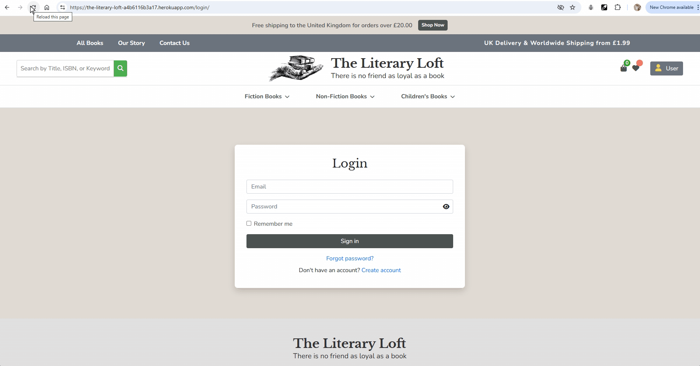

**AUTH-05: Form Validation**  

[Back to top ⬆](#table-of-contents)

### Product Browsing Testing

| ID | Test Description | Steps | Expected Result | Actual Result | Status |
|---|---|---|---|---|---|
| PROD-01 | Book Listing Display | 1. Navigate to "Books" page 2. Verify book display format | Books displayed with cover, title, author, price | Listing displayed correctly | ✅ PASS |
| PROD-02 | Category Filtering | 1. Click category filter 2. Select specific category 3. View filtered results | Only books from selected category shown | Category filter worked | ✅ PASS |

[Back to top ⬆](#table-of-contents)

### Test Evidence (Product Browsing)

**PROD-01: Book Listing Display**  

**PROD-02: Category Filtering**  

[Back to top ⬆](#table-of-contents)

### Product Details Testing

| ID | Test Description | Steps | Expected Result | Actual Result | Status |
|---|---|---|---|---|---|
| PDET-01 | Product Information | 1. Click on a book from listings 2. View product detail page | All book details displayed correctly | Information displayed as expected | ✅ PASS |
| PDET-02 | Quantity Selector & Add to Bag | 1. Adjust quantity using controls 2. Verify min/max limitations 3. Select quantity 4. Click "Add to Bag" 5. Verify success message | Quantity adjusts correctly within limits Product added to bag with confirmation | Quantity selector worked Add to bag function worked | ✅ PASS |
| PDET-03 | Related Products | 1. Scroll to bottom of product page 2. View related products section | Related books displayed relevantly | Related products showed correctly | ✅ PASS |

### Test Evidence (Product Details)

**PDET-01: Product Information**  

**PDET-02: Quantity Selector & Add to Bag**  
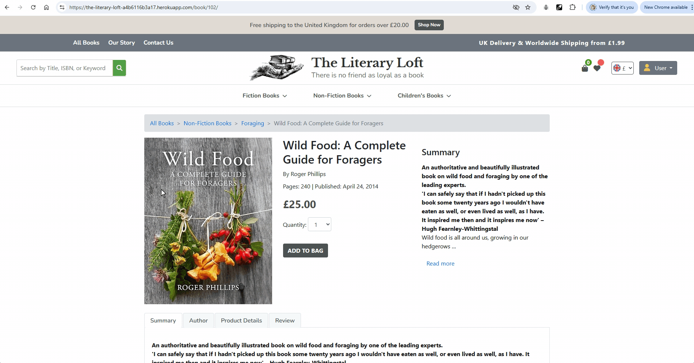

**PDET-03: Related Products**  
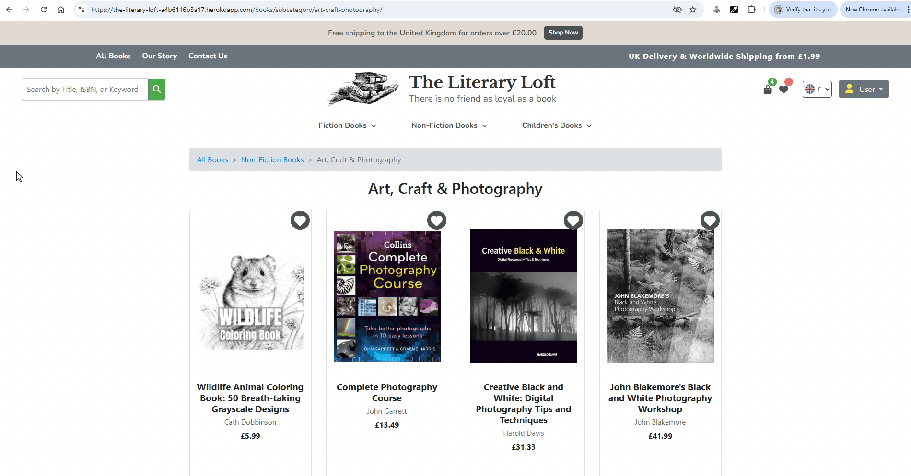

[Back to top ⬆](#table-of-contents)

### Shopping Bag Testing

| ID | Test Description | Steps | Expected Result | Actual Result | Status |
|---|---|---|---|---|---|
| BAG-01 | View Shopping Bag | 1. Add items to bag 2. Click bag icon | Bag page opens with correct items | Bag displayed correctly | ✅ PASS |
| BAG-02 | Update Quantity | 1. View bag 2. Change item quantity 3. Click "Update" | Quantity and totals update correctly | Update functionality worked | ✅ PASS |
| BAG-03 | Remove Item | 1. View bag 2. Click "Remove" on an item | Item removed, totals recalculated | Remove function worked correctly | ✅ PASS |
| BAG-04 | Bag Persistence | 1. Add items to bag 2. Close browser 3. Reopen site | Bag contents maintained | Items persisted correctly | ✅ PASS |
| BAG-05 | Empty Bag Message | 1. Remove all items from bag 2. View empty bag | "Your bag is empty" message displayed | Empty state handled correctly | ✅ PASS |

### Test Evidence (Shopping Bag)

**BAG-01: View Shopping Bag**  

**BAG-02: Update Quantity**  

**BAG-03: Remove Item**  

**BAG-04: Bag Persistence**  

**BAG-05: Empty Bag Message**  

[Back to top ⬆](#table-of-contents)

### Checkout Testing

| ID | Test Description | Steps | Expected Result | Actual Result | Status |
|---|---|---|---|---|---|
| CHKT-01 | Checkout Form | 1. Add items to bag 2. Proceed to checkout 3. View checkout form | Form displays with all required fields | Form loaded correctly | ✅ PASS |
| CHKT-02 | Form Validation | 1. Submit checkout form with missing fields 2. Observe validation messages | Appropriate error messages shown | Validation worked as expected | ✅ PASS |
| CHKT-03 | Save Information | 1. Check "Save this information" box 2. Complete checkout 3. Check profile for saved info | Information saved to user profile | Save function worked correctly | ✅ PASS |
| CHKT-04 | Payment Processing (Valid Card) | 1. Enter valid card details (4242 4242 4242 4242) 2. Complete payment | Payment processed successfully | Payment completed | ✅ PASS |
| CHKT-05 | Payment Processing (Declined Card) | 1. Enter declined card details (4000 0000 0000 9995) 2. Complete payment | Payment is declined with error message | Declined card error shown | ✅ PASS |
| CHKT-06 | Payment Processing (Authentication Required) | 1. Enter authentication required card details (4000 0000 0000 0002) 2. Complete payment | Payment fails with authentication error | Authentication error displayed | ✅ PASS |
| CHKT-07 | Payment Processing (Processing Error) | 1. Enter processing error card details (4000 0000 0000 9999) 2. Complete payment | Payment fails with processing error | Processing error message shown | ✅ PASS |
| CHKT-08 | Order Confirmation | 1. Complete checkout 2. View confirmation page | Order confirmation with details displayed | Confirmation showed correctly | ✅ PASS |
| CHKT-09 | Confirmation Email | 1. Complete checkout 2. Check email | Order confirmation email received | Email sent successfully | ✅ PASS |

### Test Evidence (Checkout)

**CHKT-01: Checkout Form**  
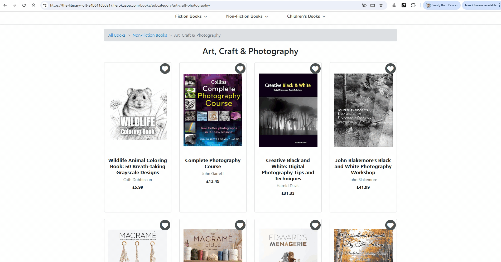

**CHKT-02: Form Validation**  
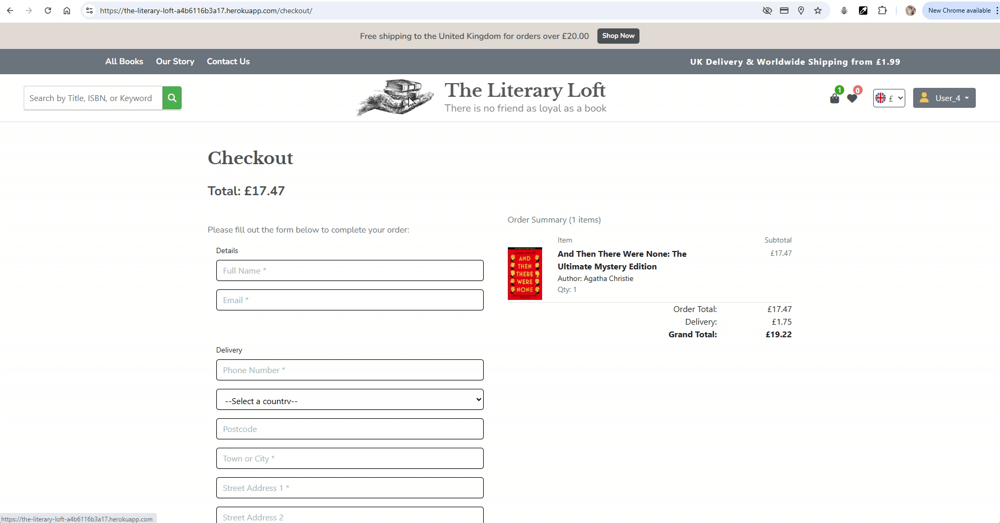

**CHKT-03: Save Information**  

**CHKT-05: Payment Processing (Declined Card)**  

**CHKT-06: Payment Processing (Authentication Required)**  
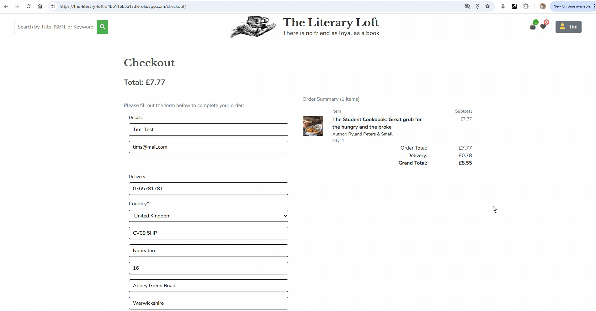

**CHKT-07: Payment Processing (Processing Error)**  
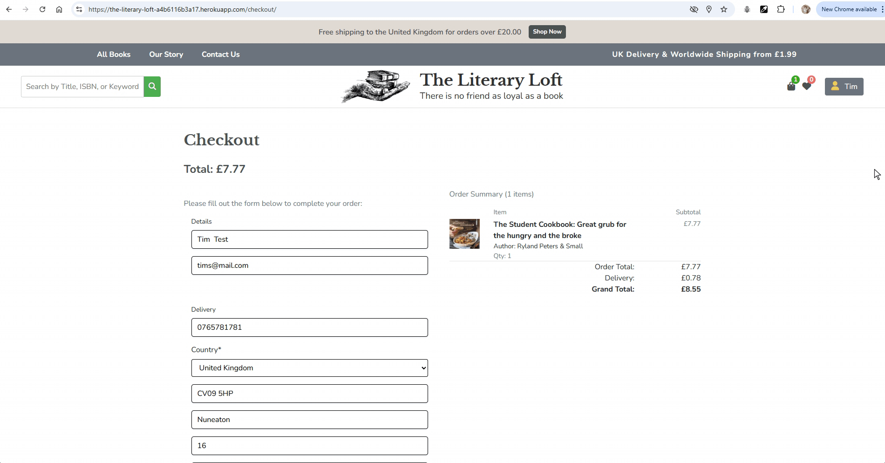

**CHKT-08: Order Confirmation** and **CHKT-09: Confirmation Email**  
  

[Back to top ⬆](#table-of-contents)

### User Profile Testing

| ID | Test Description | Steps | Expected Result | Actual Result | Status |
|---|---|---|---|---|---|
| PROF-01 | View Profile | 1. Login 2. Click user icon 3. Select "My Profile" | Profile page displays correctly | Profile loaded properly | ✅ PASS |
| PROF-02 | Update Information | 1. Navigate to profile 2. Edit personal information 3. Save changes | Information updated successfully | Update function worked | ✅ PASS |
| PROF-03 | View Order History | 1. Navigate to profile 2. View Order History section | Previous orders displayed correctly | Order history showed properly | ✅ PASS |
| PROF-04 | Order Details | 1. Navigate to order history 2. Click on order number | Detailed order information displayed | Order details showed correctly | ✅ PASS |

### Test Evidence (User Profile)

**PROF-01: View Profile**  

**PROF-02: Update Information**  

**PROF-03: View Order History** and **PROF-04: Order Details**

[Back to top ⬆](#table-of-contents)

### Admin Functionality Testing

| ID | Test Description | Steps | Expected Result | Actual Result | Status |
|---|---|---|---|---|---|
| ADMIN-01 | Access Admin Dashboard | 1. Login as staff 2. Visit admin dashboard URL | Admin panel loads successfully | Admin interface displayed correctly | ✅ PASS |
| ADMIN-02 | Add New Book | 1. Login as staff 2. Navigate to "Add Book" page 3. Submit valid book data | Book is added and visible in book list | Book added successfully | ✅ PASS |
| ADMIN-03 | Edit Book | 1. Login as staff 2. Navigate to "Edit" link of an existing book 3. Modify and save details | Changes appear on the book detail page | Edit function worked properly | ✅ PASS |
| ADMIN-04 | Delete Book | 1. Login as staff 2. Navigate to book list 3. Click "Delete" on a book 4. Confirm deletion | Book removed from database and list | Book deleted correctly | ✅ PASS |

### Test Evidence (Admin Functionality)

**ADMIN-01: Access Admin Dashboard** and **ADMIN-02: Add New Book** and **ADMIN-03: Edit Book**

**ADMIN-04: Delete Book**  

[Back to top ⬆](#table-of-contents)

## Compatibility Testing

This section outlines the testing done to ensure the application works seamlessly across different devices, browsers, and screen sizes.

### Browser Compatibility Testing

The application has been tested across multiple web browsers to ensure consistent behavior and appearance.

- **Google Chrome** (latest version): Functionality and layout tested to ensure everything works as expected.
- **Mozilla Firefox** (latest version): Verified for correct rendering and interactions.
- **Microsoft Edge**: Tested for consistent performance and styling.
- **Safari** (macOS and mobile): Checked for compatibility and responsive layout.
- **Opera and Brave**: Additional testing to ensure compatibility with other popular browsers.

No major issues were found during browser compatibility testing.

### Responsive Design Testing

This section covers testing for the responsiveness of the website across various devices and screen sizes.

- **Mobile Devices (Smartphones)**: The app’s layout, fonts, and images were tested to ensure proper scaling.
- **Tablets**: Checked for proper display of elements and readability on medium-sized screens.
- **Desktops**: Ensured that the layout adapts smoothly on larger screens, with proper alignment and visibility of content.
- **Landscape and Portrait Modes**: Tested to ensure elements adjust correctly when switching between orientations.

All major breakpoints were verified, and the app maintains a consistent, user-friendly interface across devices.
[Back to top ⬆](#table-of-contents)

### Performance Observations

| ID | Area | Observation | Status |
|---|---|---|---|
| PERF-01 | Page Load Time | Homepage loads in under 2 seconds on broadband | ✅ SATISFACTORY |
| PERF-02 | Image Loading | Product images load progressively with no visible delay | ✅ SATISFACTORY |
| PERF-03 | Search Response | Search results appear within 1 second of submission | ✅ SATISFACTORY |
| PERF-04 | Checkout Process | Payment processing completes within 3 seconds | ✅ SATISFACTORY |

[Back to top ⬆](#table-of-contents)

### Summary of Manual Testing

The Literary Loft has undergone comprehensive manual testing across all key functional areas. The testing process has verified that:

- Navigation and user interface elements function as intended
- User authentication processes work securely
- Product browsing, filtering, and search capabilities perform correctly
- Shopping bag and checkout processes complete successfully
- User profiles and admin functionality operate as designed
- The site displays and functions correctly across different devices and browsers

Overall, the manual testing confirms that The Literary Loft meets the requirements specified in the user stories and provides a robust, user-friendly shopping experience.

Accessibility Results

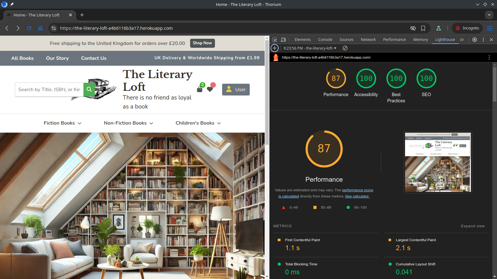
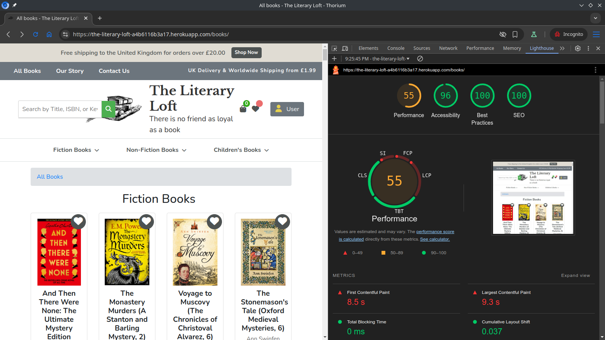
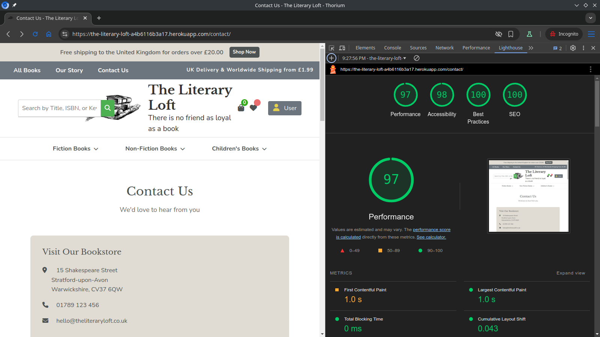
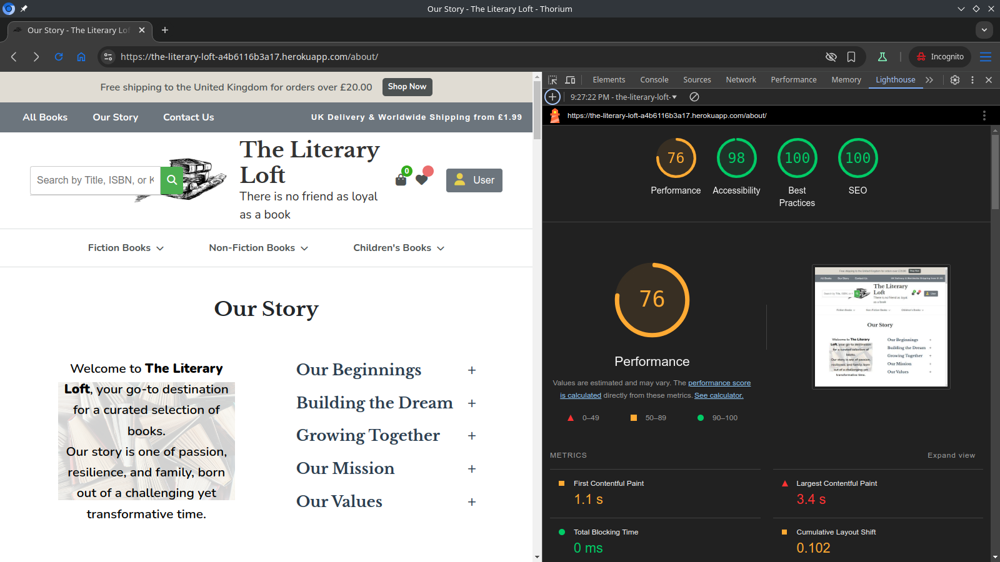
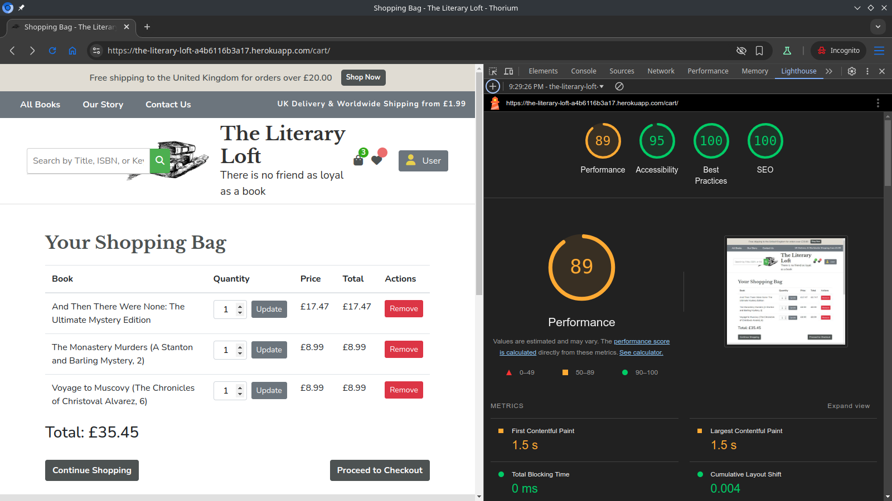
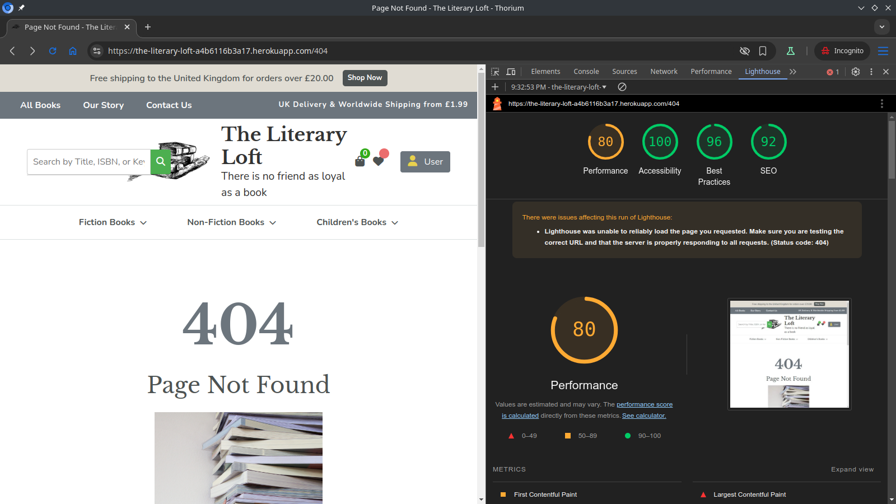

- The site displays and functions correctly across different devices and browsers.

[Back to top ⬆](#table-of-contents)

## Validator Testing

All code was validated and tested using the following tools:

- [HTML Validator](https://validator.w3.org/)
- [CSS Validator](https://jigsaw.w3.org/css-validator/)
- [JSHint](https://jshint.com/) to check the JavaScript code.
- [CI Python Linter](https://pep8ci.herokuapp.com/) to check the Python code.
- [Lighthouse](https://developers.google.com/web/tools/lighthouse/)

[Back to top ⬆](#table-of-contents)

[README.md](README.md)
